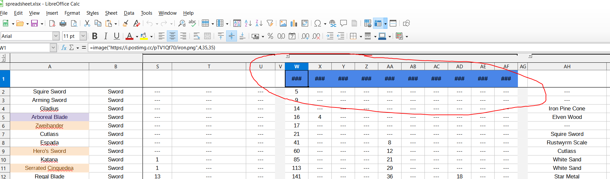
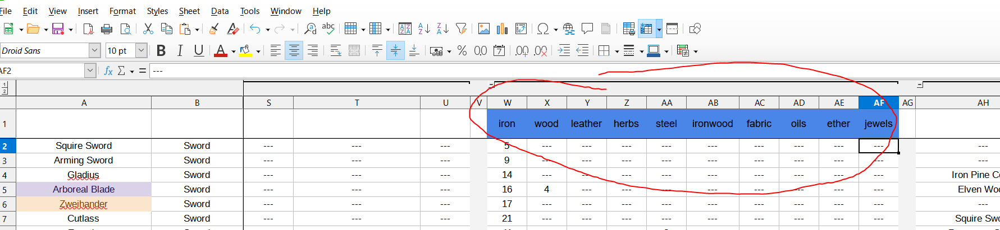

Welcome to the Shop Titans Allcalculator. This tool takes the official
Shop Titans data spreadsheet and parses it to get the up-to-date data on
blueprints, workers, etc. to figure out what items are the most profitable
depending on its configuration.

It does the following:

1. Parses data from the spreadsheet into JSON files - done
2. Parses Blueprints, Workers, 

NOTES:

The spreadsheet does NOT work out-of-the-box

Steps that need to be taken for it to be compatible:

1. replace the following headers

with these:

